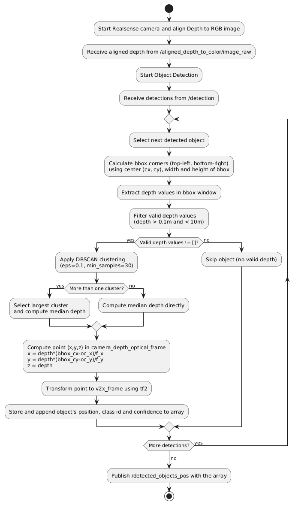
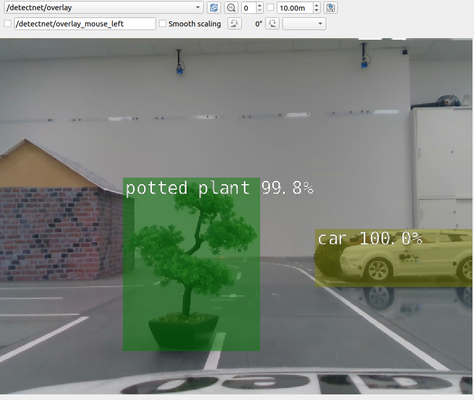
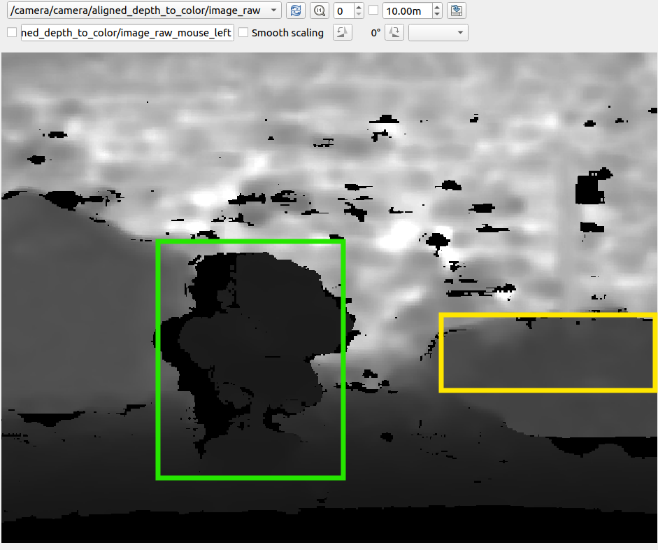
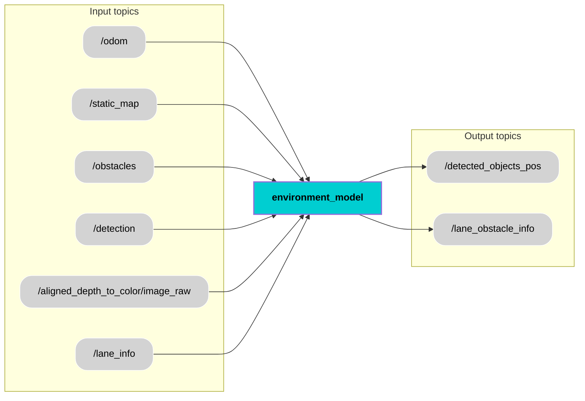

<div align="center">
  <h1 style="font-size: 36px;">Environment Model</h1>
</div>

## 📚 Contents
- [Description](#-description)
- [Architecture](#-architecture)
- [Interfaces](#-interfaces)
- [Installation](#-installation)
- [Usage](#-usage)
- [License](#-license)

## 🧠 Description
The Environment Model node receives multiple inputs from various modules essential for building a comprehensive understanding of the car’s surroundings. These inputs include the ego vehicle's position and velocity data from the `/odom` topic and a 2D grid map from the `/static_map` topic. Obstacle details are gathered from the `/obstacle_detection` topic, while object detections such as pedestrians or vehicles are received via the `/detection` topic. Additionally, lane boundary information comes from `/lane_info`.

The primary function of the Environment Model is to fuse data from various perception sources to create an accurate and real-time representation of the driving environment for the car. It processes odometry to understand vehicle dynamics, integrates map data to localize obstacles and lanes, and uses detection data to recognize dynamic and static objects, including traffic signals and pedestrians. This enables the car to make safe and informed decisions while navigating complex environments such as urban roads.

The Environment Model node provides 2 outputs to other functional modules. `/detected_objects_pos` provides the real world coordinates of the detected objects with respect to v2x frame in Model Car. `/lane_obstacle_info` provides data related to lane and obstacles with respect to base link in Model Car. 

### Functionalities:

**1. Locate all the detected objects with respect to v2x_frame frame in Model Car**

| Activity Diagram | Detection and Aligned Depth |
|------------|-------------------|
|  | <br><br> |


    The activity diagram illustrates the complete workflow for locating detected objects with respect to the v2x_frame using the RGB and depth data from the Intel RealSense camera. The process begins by initializing the camera, aligning the depth image to the RGB frame, and receiving object detections. For each detected object, the bounding box (bbox) centre coordinates, width and height are used to extract depth values in the bbox window, which are filtered (depth > 0.1m and < 10m) to retain only valid measurements. If valid depth data is available, Density-Based Spatial Clustering of Applications with Noise (DBSCAN) algorithm is used for clustering the depth values. The median depth of the largest cluster is then used to compute the 3D coordinates of the object in the camera reference frame, which are further transformed into the v2x_frame using tf2. If there is only one cluster, then median depth is calculated directly. The object’s position, class, and confidence values are stored in an array. This loop continues for all detections, and once complete, the array of detected objects with their positions is published to the /detected_objects_pos topic.    


**2. Broadcast a new dynamic v2x_frame (located on the ground below the center of the front bumper’s starting point)**

    a. Create a new frame relative to the base_link with following translation and rotation values -
        translation_x = 0.65m, translation_y = 0.0m, translation_y = -0.07m
        rotation based on roll = 0, pitch = 0 and yaw = -1*(dynamic yaw value calculated from the car's orientation given by optitrack system).
    b. This frame will have the same orientation as the map frame but will be translated based on the position of the car.

### Algorithm:
**Density-Based Spatial Clustering of Applications with Noise (DBSCAN):**

    Necessity:
    a. Center pixel depth is unreliable because the center of the bounding box may fall on the background instead of the object.
    b. Objects often have non-uniform depth (e.g., person, potted plant), so a single depth value cannot represent the entire object accurately.
    c. For clustering depth values, number of depth clusters is unknown and varies per object and scene, so a fixed-cluster algorithm (e.g., K-Means) is unsuitable.

    Design:
    a. eps (radius of the neighborhood around a data point) = 0.1m
    b. min_samples (minimum number of samples required within the eps radius to form cluster) = 30

    Evaluation:
    Verified the algorithm by giving 2 different clusters in component testing (TC_OD005 - Test step 1).


## 🧩 Architecture


## 🔌 Interfaces

### Topics:
| Name                          |IO | Type                 | Description                                                              |
|------------------------------|-----|-----------------|--------------------------------------------------------------------------|
| `/odom`    | Input |`nav_msgs/msg/Odometry.msg`      | Provides position and velocity of ego vehicle                    |
| `/static_map`  |Input |`nav_msgs/msg/OccupancyGrid.msg`      | Provides 2-D grid map                    |
| `/obstacles`     | Input|`custom_msgs/msg/ObstacleDetectionArray.msg`      | Provides angles and ranges                    |
| `/detection`    |Input |`vision_msgs/msg/Detection2DArray.msg`      | Array of 2D detecttions with class labels and confidence score                    |
| `/lane_info`      | Input|`custom_msgs/msg/LaneInfo.msg`      | Contains detected left, right, and center lane boundaries, angle, curvature,width, and confidence.                  |
| `/detected_objects_pos`| Output | `custom_msgs/msg/DetectedObjectsPositionArray.msg`      | Provides the real world coordinates of the detected objects with respect to v2x frame in Model Car.                   |                   |
| `/lane_obstacle_info` | Output |`custom_msgs/msg/LaneObstacleArray.msg`      | Provides data related to lane and obstacles with respect to base link in Model Car.                    |

### Custom messages:
#### Message: [`ObstacleDetectionArray.msg`](https://git.hs-coburg.de/pax_auto/obstacle_detection#message-obstacledetectionarraymsg)
#### Message: [`LaneInfo.msg`](https://git.hs-coburg.de/pax_auto/lane_detection#message-laneinfomsg)
#### Message: `DetectedObjectsPositionArray.msg`
| Name                          | Type                 | Description                                                              |
|------------------------------|----------------------|--------------------------------------------------------------------------|
| `detection_time`      | `float64`      |   The time when the objects were detected                 |
|  `array` |  `DetectedObject[]` |  Information of detected objects in array        |

#### Message: `DetectedObject.msg`
| Name                          | Type                 | Description                                                              |
|------------------------------|----------------------|--------------------------------------------------------------------------|
|  `id` |  `uint8` |  Incremental number of detected objects       |
|  `class_id` |  `string` |   Unique class id of the detected objects         |
|  `confidence` |  `uint8` |  Confidence score (0-100) of the detection       |
|  `x` |  `int32` |   x coordinate (cm) of the detected object with respect to v2x frame         |
|  `y` |  `int32` |  y coordinate (cm) of the detected object with respect to v2x frame       |
|  `z` |  `int32` |   z coordinate (cm) of the detected object with respect to v2x frame          |

#### Message: `LaneObstacleArray.msg`
| Name                          | Type                 | Description                                                              |
|------------------------------|----------------------|--------------------------------------------------------------------------|
| `lane`      | [`custom_msgs/LaneInfo[]`](https://git.hs-coburg.de/pax_auto/lane_detection#message-laneinfomsg)      |   Contains detected left, right, and center lane boundaries, angle, curvature,width, and confidence with respect to base_link                 |
|  `obstacles` |  [`custom_msgs/ObstacleDetectionData[]`](https://git.hs-coburg.de/pax_auto/obstacle_detection#message-obstacledetectiondatamsg) | Transformed obstacles from lidar frame to base_link    |

## 🛠️ Installation
1. Create workspace, src and go to src
```bash
mkdir temp_ws
cd temp_ws
mkdir src
cd src
```
2. Clone component repository
```bash
git clone https://git.hs-coburg.de/pax_auto/environment_model.git
```
3. Clone additional repositories
```bash
git clone https://git.hs-coburg.de/pax_auto/custom_msgs.git
git clone https://git.hs-coburg.de/Autonomous_Driving/car_description.git
```
4. Return to workspace and build the packages
```bash
cd ..
colcon build
```
5. Source the setup files
```bash
source install/setup.bash
```

## ▶️ Usage
1. Launch the car description
```bash
ros2 launch car_description visualize_model.launch.py car_id:=4
```
2. Launch the environment model node
```bash
ros2 launch environment_model environment_model_launch.py
```

## 🔒 License
Licensed under the **Apache 2.0 License**. See [LICENSE](LICENSE) for details.
